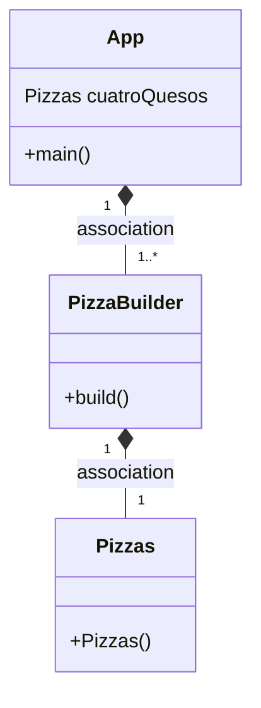

# Patrón Builder

---

## Diagrama de clases

```mermaid
classDiagram
      class App{ 
        Pizzas cuatroQuesos
        +main()
      }
      App "1" *-- "1..*" PizzaBuilder : association
      class PizzaBuilder{
          +build()
      }
      PizzaBuilder "1" *-- "1" Pizzas : association
      class Pizzas {+Pizzas()}      
```